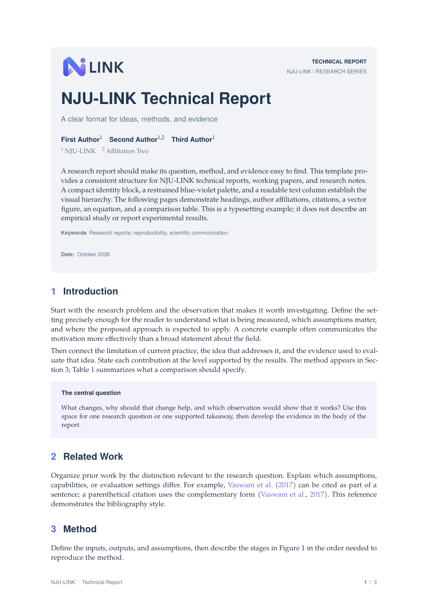
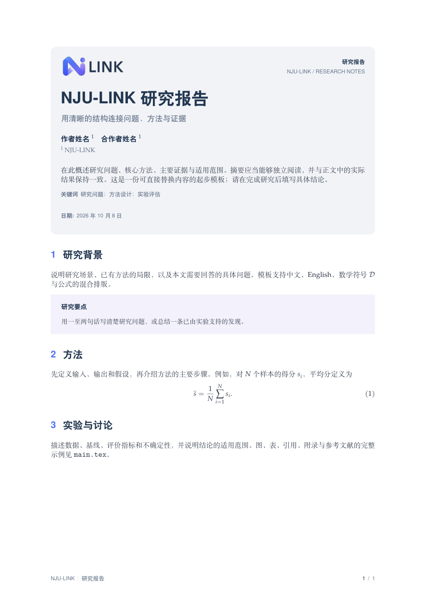

# NJU-LINK LaTeX Template

用于 NJU-LINK 技术报告、工作论文与研究笔记的 LaTeX 模板。统一蓝紫配色，
支持中英文排版，包含多作者、图表、公式、参考文献和附录示例。
首页参考 [Llama 3 论文 v3](https://arxiv.org/abs/2407.21783v3)：Logo、标题、
作者、摘要与元信息置于同一个浅灰圆角区域，摘要直接接在作者信息之后。

**[英文示例 PDF（3 页）](docs/preview/main.pdf)** ·
**[中文起步稿 PDF（1 页）](docs/preview/starter.pdf)** ·
**[下载源码 ZIP](https://github.com/NJU-LINK/latex-template/archive/refs/heads/main.zip)**

## 效果预览

点击首页图片可查看完整 PDF。

<p align="center">
  <a href="docs/preview/main.pdf">
    
  </a>
</p>

<details>
<summary>查看中文起步稿预览</summary>

<p align="center">
  <a href="docs/preview/starter.pdf">
    
  </a>
</p>

</details>

## 在 Overleaf 使用

1. 下载上方的源码 ZIP，在 Overleaf 中选择 New Project → Upload Project 上传。
2. 项目设置中选择 **XeLaTeX**，主文件选择 **main.tex**。
3. 修改 `main.tex` 开头的标题、作者、单位、日期与摘要，再替换示例正文。
4. 中文起步稿可将主文件切换为 **starter.tex**；同样使用 XeLaTeX。

建议使用 Overleaf 当前稳定版 TeX Live。字体随 TeX Live 分发，无需安装商业字体，
无需 shell escape。正文示例说明写作结构和排版用法，不代表真实研究或实验结果。

## 文件结构

| 文件 | 用途 |
| --- | --- |
| `main.tex` | 完整英文报告示例，含流程图、公式、表格、引用与附录 |
| `starter.tex` | 可直接开始填写的中文简洁模板 |
| `njulink.cls` | NJU-LINK 文档类，包含全部排版样式 |
| `tokenwave.cls` | 旧类名的兼容入口，转交给 `njulink.cls` |
| `figures/njulink-logo.png` | NJU-LINK Logo，保留原有比例与颜色 |
| `figures/njulink-logo-transparent.png` | 浅灰首页与页眉使用的透明背景 Logo |
| `references.bib` | 示例参考文献 |
| `assets/plainnat.bst` | 原模板附带的参考文献样式，原样保留 |
| `upstream/` | 原始 FAIR 与 TokenWave 类文件及说明，保留来源记录 |
| `.latexmkrc` | 本地 latexmk 的 XeLaTeX 配置 |
| `docs/preview/` | 已编译的英文、中文 PDF 及对应首页预览图 |

## 原有接口继续使用

```tex
\documentclass{njulink}
\title{Your Paper Title}
\author[1,2]{First Author}
\author[1]{Second Author}
\affiliation[1]{NJU-LINK}
\affiliation[2]{Another Institution}
\contribution[*]{Equal contribution}
\abstract{Your abstract.}
\correspondence{First Author at \email{name@example.org}}
\date{\today}
\metadata[Code]{\url{https://example.org/project}}
```

每位作者单独调用一次 `\author`，角标用于对应单位或贡献说明。
无须显示的元信息直接删除或注释该行；不再默认放置空贡献脚注。
`\maketitle` 在一个浅灰圆角块中依次输出 Logo、标题、作者信息、摘要与元信息。
摘要使用正文字号，关键词接在摘要后，日期和链接等元信息位于框底。
`\beginappendix` 切换为字母编号的附录章节，通常在它前面加 `\clearpage`。
正文中的 `\Cref`、`\citep`、`\citet` 与原模板一致。

旧文档也可以保留 `\documentclass{tokenwave}`。旧的 `twbox` 环境及 `tw...`、
`meta...` 颜色名仍可使用，但会显示 NJU-LINK 新样式。原样快照放在 `upstream/`，
这些文件不参与编译。

## 新增的集中设置

```tex
\njulinksetup{
  type={Technical Report},
  id={NJU-LINK / 2026-01},
  short-title={A Short Running Title},
  subtitle={Optional subtitle},
  version={Draft v1.0},
  keywords={Keyword one; keyword two},
  logo={figures/njulink-logo-transparent.png},
  logo-width={30mm}
}
```

可选字段设为空值即可隐藏。长标题可用 `\\` 手动换行，页眉使用简短的
`short-title`。推荐单栏报告；需要双栏时使用 `\documentclass[twocolumn]{njulink}`，
首页信息仍横跨两栏，正文中的宽图表请改用 `figure*` / `table*`。

中文模式使用 `\documentclass[chinese]{njulink}`，图、表、附录及参考文献标题
和关键词标签会切换为中文。XeLaTeX 下的英文模式也支持正文中穿插中文。

## 样式与组件

- 正文：TeX Gyre Pagella；标题与作者：TeX Gyre Heros；中文：Fandol。
- 深蓝 `LinkNavy`：`#233650`，取自 Logo 文字；蓝色 `LinkBlue`：`#4B6FF9`；
  紫色 `LinkPurple`：`#7561EA`。统一修改 `njulink.cls` 的颜色区即可换色。
- 首页使用参考稿的浅灰色 `LinkTitlePanel`（`#F1F4F7`）、8 pt 圆角与 5 mm 左右内边距。
- 图表保持标准 `figure`、`table`、`equation` 与 `subfigure` 用法。
- 表格使用 `booktabs` 和 `tabularx`，可用 `\rowcolor{LinkPanel}` 设置浅色表头。
- 重点提示使用 `\begin{njubox}[title={Key idea}] ... \end{njubox}`。
- 参考文献使用原模板的 `\bibliographystyle{assets/plainnat}`。
- 目录与 PDF 书签保留标准功能，可按需使用 `\tableofcontents`。

正文粗体保持当前字体族，避免像原稿那样突然切换成无衬线字体。
Logo 保持原有比例，透明背景版本用于浅灰首页与页眉；白底裁边版本一并保留。

## 本地编译

完整 TeX Live 环境：

```sh
latexmk -xelatex main.tex
latexmk -xelatex starter.tex
```

也可使用 Tectonic（自动处理 BibTeX 与交叉引用）：

```sh
tectonic main.tex
tectonic starter.tex
```

英文模式保留 pdfLaTeX 的字体配置分支；推荐及实际验收使用 XeTeX / Tectonic。
中文模式请选择 XeLaTeX。

已通过 Tectonic 0.17.0 的编译与页面检查：英文完整示例、中文起步稿、
原模板正文接口兼容，以及双栏、多作者、贡献说明、交叉引用和附录。

## 来源

原模板为 TokenWave 技术报告类，派生自 FAIR `fairmeta.cls` v1.1
（原作者标注为 dlp@meta.com），首页结构参考 Llama 3 论文 v3
（[arXiv:2407.21783v3](https://arxiv.org/abs/2407.21783v3)）中的 `fairmeta.cls`。
原始类文件及 README 保留在 `upstream/`，原参考文献样式保持不变。
NJU-LINK Logo 保留原有颜色、比例与渐变细节。
